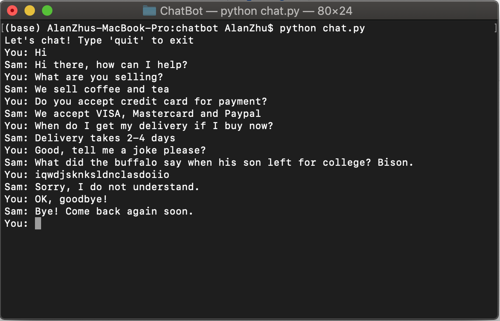
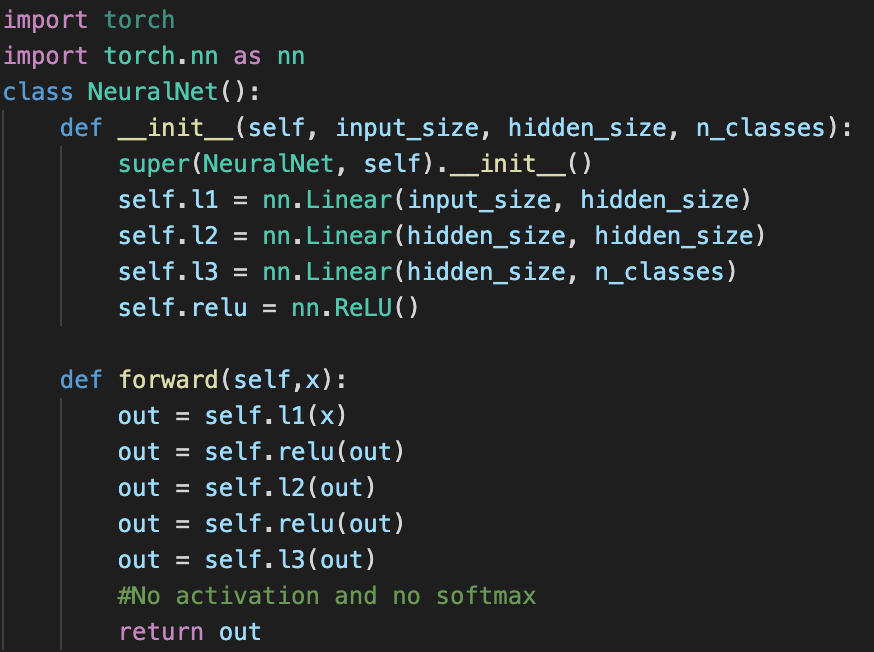

# Chatbot !!!(Conducting research on GUI and Making GUI for the chatbot)!!!
The project aims to reproduce a AI chatbot for online coffee and tea retail. A Feed-forward neural network is implemented to classify the bag of words generated from the customer interaction. The activation of the last layer is softmax. If the predicted probability of all the classes is lower than 75%, the bot will say "Sorry, I do not understand.". Otherwise, one of the pre-defined responses will be randomly chosen from the predicted class and answer the customer enquiry. The bot can be easily scaled to handle more types of enquiry by simply adding more intents into the "intents.json" file.

## The package I used are:
1. nltk: natrual language processing.
2. torch: define model architect and trainning pipeline. (NeuralNet class is inherited from torch.nn.Module)
3. Others: Numpy ...

Feel free to download and use the code and try it yourself! After downloading all files, type in "python chat.py" in terminal to play around.

# Example

# Model Architecture
Model have 1 input layer and 1 hidden layer (relu), and 1 output layer (Softmax) which has number of neurons equal to the number of tags.

